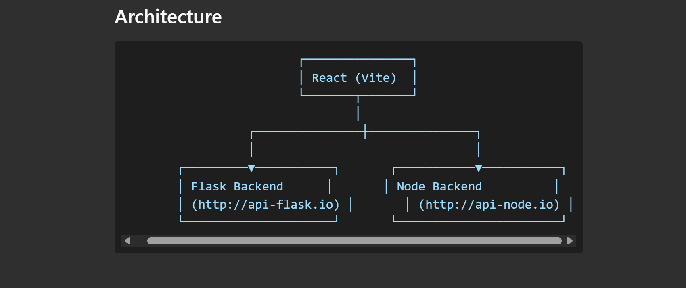
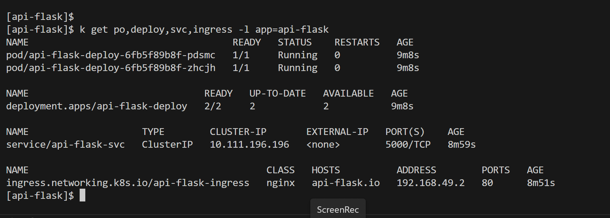
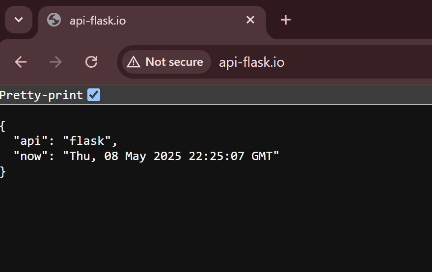

# Kubernetes Microservice with Flask, Node, and React (Vite)

This project is a Kubernetes-based microservice application consisting of three main components:

- Frontend: A React Vite application for the user interface.

- Backend 1: A Flask API for processing timezone-based requests with a health check endpoint.

- Backend 2: An Express Node.js API for additional timezone-based processing with a health check endpoint.

The microservices are orchestrated using Kubernetes with Ingress routing for easy access.

## Demo

[](https://www.youtube.com/watch?v=MEQb02ErEtc)

<video width="700" controls>
  <source src="https://github.com/bosukeme/k8s-microservices-architecture/raw/main/assets/home-page.mp4" type="video/mp4">
  Your browser does not support the video tag.
</video>

## Architecture

  

## Prerequisites

- Docker Desktop (with Kubernetes enabled)
- kubectl
- Helm
- minikube

## Setup Instructions

1.  Clone the repository:

    ```bash
    git clone https://github.com/bosukeme/k8s-microservices-architecture.git
    cd k8s-microservices-architecture
    ```

2.  Deploy the Flask API

    ```
    cd k8s/api-flask
    kubectl apply -f flask.deployment.yaml
    kubectl apply -f flask.service.yaml
    kubectl apply -f flask.ingress.yaml
    ```

    Verify if the resources were created successfully:

    ```
    kubectl get po,deploy,svc,ingress -l app=api-flask
    ```

    <br/>
    

3.  Setup Minikube Tunnel: <br />
    Open a new terminal and run:
    ```
    minikube tunnel --bind-address 0.0.0.0
    ```
4.  Set up `/etc/hosts`:

        ```
        # Linux / MacOs
        minikube ip

        # Windows (WSL)
        hostname -I
        ```
        Edit `/etc/hosts`  (Linux/MacOS) or `c\windows\system32\drivers\etc\hosts` (Windows). <br/>
        Add `<ipaddress from the above step>   	api-flask.io` <br/>
        * Example
        ```
        172.29.204.16     	api-flask.io
        ```
        <br/>

    <br>

5.  Verify Flask API Setup <br>
    Visit `http://api-flask.io` in your browser
    <br/>
    

6.  Possible troubleshooting: <br>

    If you are unable to access the endpoint:

    - Restart Minikube Tunnel:

    ```
    sudo pkill -f "minikube tunnel"
    minikube tunnel --bind-address 0.0.0.0
    ```

    - Ensure the Ingress Controller IP type is `LoadBalancer`:

    ```
    kubectl patch svc ingress-nginx-controller -n ingress-nginx -p '{"spec": {"type": "LoadBalancer"}}'
    ```

7.  Deploy the Node API <br />
    Open a new terminal:

    ```
    cd k8s/api-node
    kubectl apply -f node.deployment.yaml
    kubectl apply -f node.service.yaml
    kubectl apply -f node.ingress.yaml
    ```

    Verify:

    ```
    kubectl get po,deploy,svc,ingress -l app=api-node
    ```

    Update `/etc/hosts` with:
    Add `<ipaddress from the above step>   	api-node.io` <br/>

    - Example

    ```
    172.29.204.16     	api-node.io
    ```

    <br/>

    Visit `http://api-node.io` on the browser

8.  Deploy the React Client <br />

    Open a new terminal:

    ```
    cd k8s/client-react
    kubectl apply -f react.deployment.yaml
    kubectl apply -f react.service.yaml
    kubectl apply -f react.ingress.yaml
    ```

    Verify

    ```
    kubectl get po,deploy,svc,ingress -l app=client-react
    ```

    Update `/etc/hosts` with:
    Add `<ipaddress from the above step>   	client-react.io` <br/>

    - Example

    ```
    172.29.204.16     	client-react.io
    ```

    <br/>

    Visit `http://client-react.io` on the browser

## Cleanup

- kubectl delete -f k8s/api-flask/
- kubectl delete -f k8s/api-node/
- kubectl delete -f k8s/client-react/

## Contributing

If you would like to contribute, please follow these steps:

- Fork the repository.
- Create a new branch for your feature or bugfix.
- Submit a pull request.

## Authors

Ukeme Wilson

- <a href="https://www.linkedin.com/in/ukeme-wilson-4825a383/">Linkedin</a>.
- <a href="https://medium.com/@ukemeboswilson">Medium</a>.
- <a href="https://www.ukemewilson.sbs/">Website</a>.
